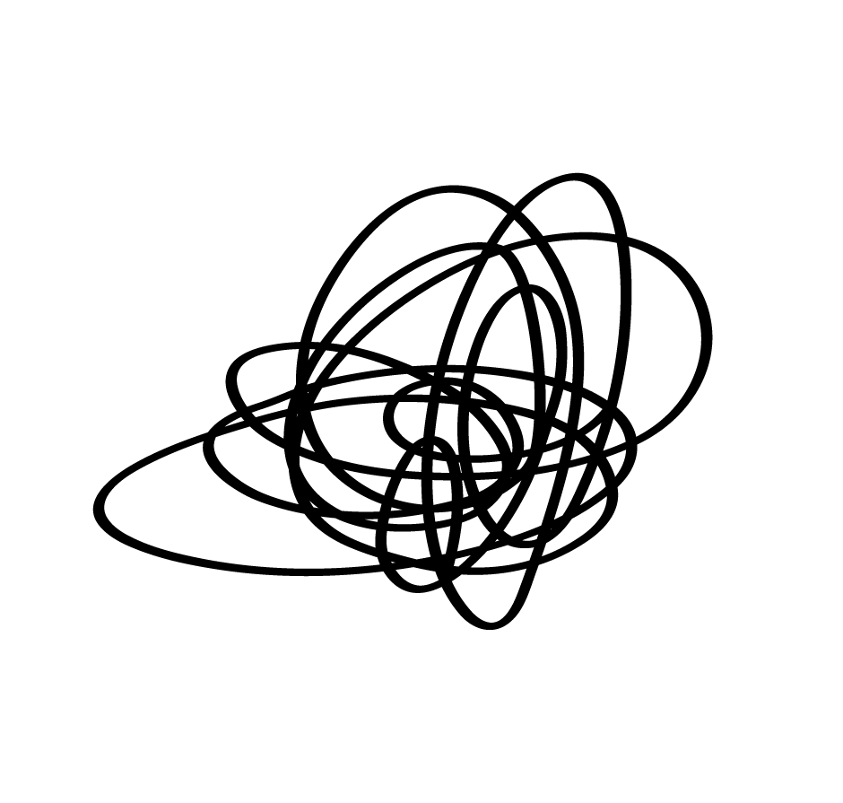

 
 <h2 align="center">Khaos Library</h2>
 
A CreativeWork Metadata Library On Blockchain

  

  

  

    <a href="/README.md">English</a> |
    <a href="/README_zh.md">中文版</a>
  

## Features 
- Free access and use of data by any person or organisation
  - Open data in json-ld format for ease of use .
  - Book information can be queried by isbn/oclc etc.
  - Film information can be queried by imdb/tmdb id, etc.
  - etc.
- Includes various creative work metadata (e.g. book/movie/music/game/theatre).
  - Book ISBN, publication, cover, author, etc.
  - Film rating, release, poster, director, cast, etc.
  - etc.
- Permanent and decentralised storage
- Censorship resistance
- Any person or organisation can edit and contribute data

## Structure and Model
Reuse [schema.org](https://schema.org) word lists modelled using the **FRBR** model.

See [details](doc/Model.md)

## Queries
Queries are currently available through Arweave's official or unofficial gateway.
Sample queries

## Contributions
## Data structure suggestions
- Please submit a issue
### Contributing data
- If you have a lot of data on books/movies/games/music etc, please contact me by email or matrix.
- If you want access to create and edit entries, please be patient and wait for the first phase of development to be completed!
## License 
under the   cc-by-4.0 license .
