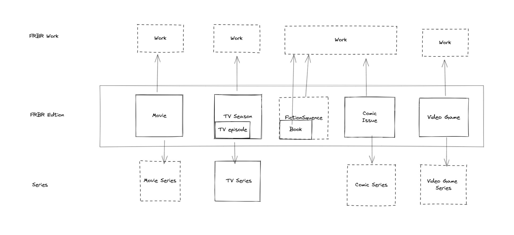

## Model
Referenced Bibframe and LRM .

## Structured data type definitions

While the full definition of Data(Thing) is available at https://schema.org, you only need to consider the following properties.

## [Thing](https://schema.org/Thing)

| Property      | Type                                                      | Required | Description                                                  |
| ------------- | --------------------------------------------------------- | -------- | ------------------------------------------------------------ |
| @context      | [Text](https://schema.org/Text)                           | Yes      | Set to `https://o.khaoslibrary.org/context.json`.            |
| @id           | [Text](https://schema.org/Text)                           | Yes      | A globally unique ID for the Thing in URL format             |
| adminMetadata | [CreativeWork](https://schema.org/CreativeWork)           | Yes      | Metadata about the metadata, such as contributors and etc   Entries are used to describe Things, but the entries themselves have their contributors and other metadata, so this attribute is added. According to the original design of schema.org, DataFeed as top-level data can be solved, but it is very unfavourable for consumption and parsing. Definition in :http://id.loc.gov/ontologies/bibframe/AdminMetadata |
| description   | @container                                                | No       |                                                              |
| alternateName | @container                                                | No       |                                                              |
| identifier    | List of [PropertyValue](https://schema.org/PropertyValue) | Yes      | The external or other ID that unambiguously identifies this edition.    Multiple      identifiers are allowed. For more details, refer to       [identifier](#[identifier](https://schema.org/identifier)).   |

##  [CreativeWork](https://schema.org/CreativeWork)

| Property   | Type                                                         | Required | Description                                                  |
| ---------- | ------------------------------------------------------------ | -------- | ------------------------------------------------------------ |
| author     | [Person](https://schema.org/Person) or              [Organization](https://schema.org/Organization) | Yes      | The author of this  CreativeWork.                            |
| name       | [Text](https://schema.org/Text)                              | Yes      | The name of the CreativeWork.                                |
| inLanguage | [Text](https://schema.org/Text)                              | Yes      | The main language of the content in the CreativeWork.   For Work, it's the original language of the work.  The language tag *MUST* be well-formed according to section     [2.2.9 Classes of Conformance](https://tools.ietf.org/html/bcp47#section-2.2.9)   of [[BCP47](https://www.w3.org/TR/json-ld11/#bib-bcp47)]. |
| genre      | [Text](https://schema.org/Text)                              | No       | Use one of the words  from the [Genre/Form Terms (LCGFT)](https://id.loc.gov/authorities/genreForms) |
| image      | [URL](https://schema.org/URL)                                | No       | To be sufficiently decentralised, the original plan was to use arweave-hash for this value, but that wouldn't comply with the schema.org specification and would be misleading to the three parties using the data, so the official Arweave gateway is used here.  One caveat is that the final hash (after the https://arweave.net/) is arweave-hash and you can use it with any gateway. |

## Work

Resource reflecting a conceptual essence of a cataloging resource.
Definition in :  http://id.loc.gov/ontologies/bibframe/Work

It is a **CreativeWork** type that does not distinguish between specific subclasses, such as Book, Movie, etc.

One of the most common observations at the last FBRB workshop held at OCLC was that few bibliographic records require FRBR aggregation.

And the latest statistics were presented: 88% of works in WorldCat have only one bibliographic record.

Also due to cost considerations, it is not made a mandatory entity type to implement, i.e:
Not every Book (edition) corresponds to owning a Work,  and Work is only created when several Books are editions of the same Work.

| Property                                      | Type                                                    | Required | Description                                                  |
| --------------------------------------------- | ------------------------------------------------------- | -------- | ------------------------------------------------------------ |
| [workExample](https://schema.org/workExample) | List of [CreativeWork](https://schema.org/CreativeWork) | Yes      | Example/instance/realization/derivation of the concept of this creative  work. E.g. the paperback edition, first edition, or e-book. |
| genre                                         | [Text](https://schema.org/Text)                         | No       | Use  words  from the  [Genre/Form Terms (LCGFT)](https://id.loc.gov/authorities/genreForms) |

## BookSeries

TODO

## [Book](https://schema.org/Book)

| Property   | Type                                     | Required   | Description                                                  |
| ---------- | ---------------------------------------- | ---------- | ------------------------------------------------------------ |
| bookFormat | [`Enum`](https://schema.org/Enumeration) | Yes        | The format of the edition. The value of this must be one of the              following:       -  [EBook](https://schema.org/EBook)  -  [Hardcover](https://schema.org/Hardcover)  -  [Paperback](https://schema.org/Paperback)   -  [GraphicNovel](https://schema.org/GraphicNovel)   When the format type is [AudiobookFormat](https://schema.org/EBook), it should be classified as a subclass of Book [Audiobook](https://schema.org/Audiobook). |
| isbn       | Text                                     | No.   | The ISBN-13 of the edition.   Normally, at least one of the isbn(13) and isbn10 must be present. Only if the value of "bookFormat" is "EBook" or "AudiobookFormat", it is not required.  |

[Sample Data](https://arweave.net/m7qwCmGcT4aIS9JNqExzB5OMIXzHviXxmGe634dP4iw)

## [identifier](https://schema.org/identifier)

The `identifier` property of the  [Thing](https://schema.org/Thing)  uses the `PropertyValue`    entity.

| properties   | Description                                                  |
| ------------ | ------------------------------------------------------------ |
| `@type`      | [`Text`](https://schema.org/Text)            Set to `PropertyValue`. |
| `propertyID` | [`Text`](https://schema.org/Text)            The type of ID. |
| `value`      | [`Text`](https://schema.org/Text)            The ID value. The external ID that unambiguously identifies this edition. Remove all              non-numeric prefixes of the external ID. |

PropertyValue in Schema.org is very flexible and can be extended by the user, but it can also be confusing for the parser.

For example, in the usage examples provided by Schema.org, they describe the oclc resource id as 'OCoLC', while [Google uses 'OCLC_NUMBER'.](https://developers.google.com/search/docs/appearance/structured-data/book#isbn-and-other-supported-identifiers)

While it is possible to use URL to describe it accurately, this option is not considered because it is too redundant.

Here, for the time being, we define some ‘propertyID’ for different things with supported identities.
(WIP)
### Person or   Organization

- VIAF
- WIKIDATA

###  Work

- OPENLIBRARY
- WIKIDATA

### Book

- OPENLIBRARY
- ISBN10
- OCLC_NUMBER
- JP_E-CODE
- LCCN
- GOODREADS
- DOUBAN
- LIBRARYTHING
- CSBN

### Movie And TV

- IMDB
- TMDB
- DOUBAN
- ANIDB
- BANGUMI

